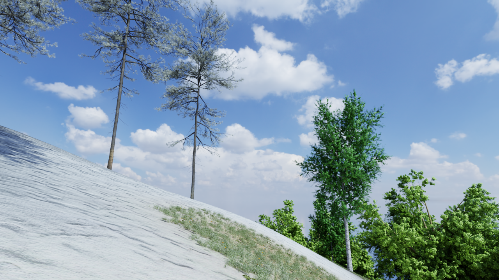
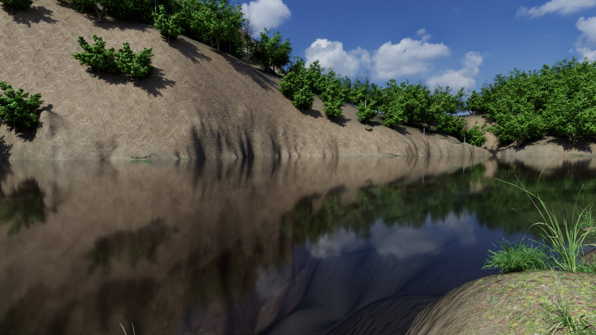
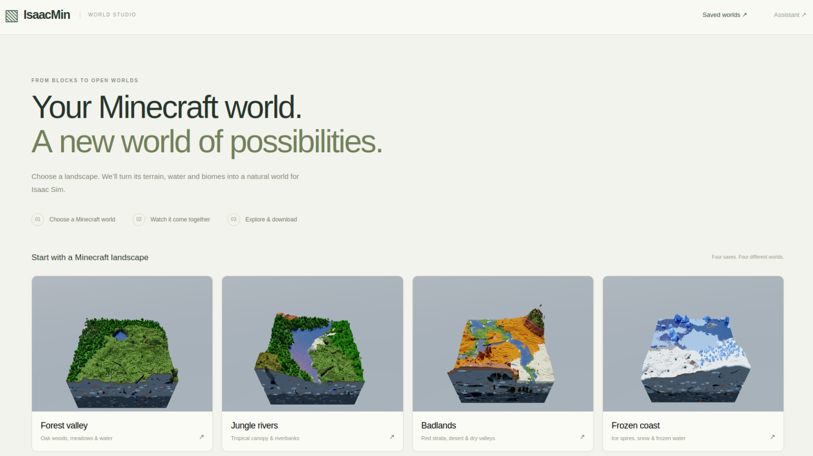
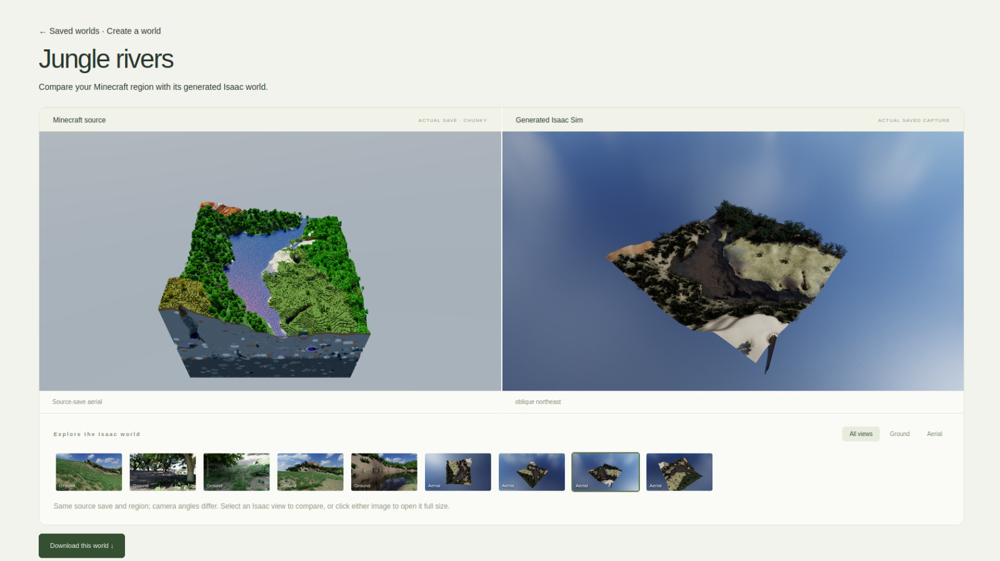
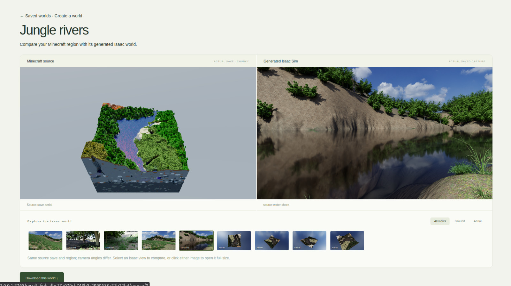

# IsaacMin

https://github.com/user-attachments/assets/511295b4-9c28-440c-996d-b0efe4071160

*75-second narrated demo — turn on sound. Choose a Minecraft map, watch the agent build, explore the results,
and download the world. Rendering waits are condensed. [Video credits](docs/media/demo-video.md).*

**Minecraft worlds → realistic Isaac Sim environments. Built by an AI agent.**

Robots learning long-range navigation need far more varied terrain than a handful
of hand-built simulation maps can provide. Creating those environments is slow,
expensive and difficult to scale.

IsaacMin taps into **Minecraft's extraordinary terrain generator as a virtually
unlimited source of simulation worlds**. Mountains, forests, rivers, deserts and
frozen landscapes become detailed, navigable 3D environments in NVIDIA Isaac Sim:
natural terrain, real vegetation, physical materials, ground collision and sensor
captures. Minecraft supplies the geography. IsaacMin brings it into robotics.

**Designed to extend to multi-kilometre worlds.** The four demo presets showcase
**256 × 256 m regions**. The same pipeline accepts configurable regions up to
**2,048 × 2,048 m**, reconstructing the landscape together and exporting larger
terrain in sections. A **1.536 km-wide scene has already been constructed**;
reliable Isaac rendering and delivery at that scale still need optimisation and
validation. The video demonstrates the complete workflow at the 256 m demo scale.

| Snowy hillside · Isaac Sim | River reflections · Isaac Sim |
| --- | --- |
|  |  |

## An agent that does the work

Powered by **NVIDIA Nemotron on OpenClaw**, the IsaacMin agent turns one request
into a long-running world-building job. It uses specialised tools to inspect
worlds, understand job state, initiate conversions, verify outputs, prepare
downloads and create new camera views. It selects tools and arguments from your
request and the evidence those tools return.

Once a conversion starts, the agent drives terrain reconstruction, scene assembly,
collision generation, Isaac rendering and delivery **without human intervention
between stages**. Durable jobs and checkpoints keep progress independent of the
browser and let interrupted work resume without throwing away completed stages.

Ask it to **“Create this world,” “Show me three aerial views,”** or **“Resume my
interrupted conversion.”** It acts through tools and returns real job results.

## The demo

Choose from four Minecraft presets, watch the world take shape, compare Minecraft
and Isaac side by side, then download the portable USD world. Request more ground
or aerial views whenever you need them.

**Choose your landscape.**

**Compare Minecraft and Isaac from above.**

**Explore the riverbank at ground level.**

**Built on DGX Spark / GB10 / Linux ARM64**, with HighMap, Blender, Isaac Sim,
OpenClaw and NVIDIA-hosted Nemotron. [Setup](docs/SETUP.md) ·
[Agent tools](docs/AGENT.md) · [Architecture](docs/ARCHITECTURE.md) ·
[Asset credits](ASSET_CREDITS.md)

*Full navigation/realism qualification remains future work. Source saves, native
runtimes and large asset libraries are provisioned separately from this source repo.*
