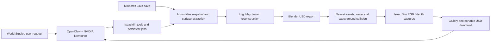

# From Minecraft save to Isaac world

Minecraft provides landscape structure and biome observations. Reconstruction
removes block-scale terracing while retaining broad mountains, valleys and
surface-water geography. Source observations guide reusable biome/material and
vegetation recipes. Structures and underground geometry are outside this demo's
scope.

The orchestration layer is Python. HighMap, Blender, OpenUSD and Isaac run through
isolated native workers on Linux ARM64. The browser displays saved Isaac images;
its lightweight construction animation is a labelled preview of completed terrain
and placement data, not a live Isaac renderer.

| Directory | Responsibility |
| --- | --- |
| `src/isaacmin/demo/`, `integrations/openclaw/` | Agent harness, tool registry, persistent jobs, studio API |
| `src/isaacmin/source/` | Java save decoding, snapshots and source extraction |
| `src/isaacmin/outdoor_*.py`, `src/isaacmin/assembly/` | Terrain-to-world orchestration, materials and natural scene assembly |
| `scripts/native/`, `blender_scripts/`, `isaac_scripts/` | Native terrain, export, renderer and sensor workers |
| `web/` | Preset picker, progress animation, assistant and comparison galleries |
| `configs/`, `recipes/`, `schemas/` | Pinned dependencies, scene recipes and tool/data contracts |
| `tests/` | Controller, source, geometry, security and integration regression checks |

The saved-world demo has four 256 m regions: Forest valley, Jungle rivers,
Badlands and Frozen coast. Real end-to-end OpenClaw execution produced a fresh
Forest valley conversion with eleven stage dispatches, eight Isaac images and a
portable ZIP. A separate hosted-agent request rendered an additional Jungle
aerial without rebuilding the scene. The README images are original captured
bytes; [their manifest](media/manifest.json) records provenance and hashes.

These observations establish the demonstrated workflow, not general robot
navigation performance. Continuous 1 km delivery, full temporal/contact/realism
qualification and validation on a supplied navigation stack remain unfinished.
